# Electronic system of GOCART

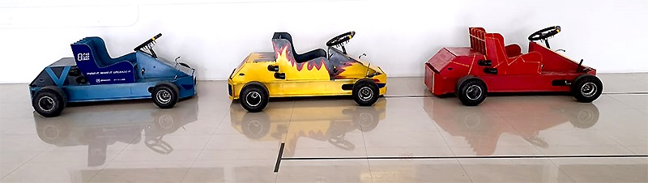

The electronic system of the go carts have several purposes
1.	Improve driving experience and safety of the car
2.	Give extra functionality like a real car
    *	control Lights
    *	signaling for left and right
    *	producing beep sounds for notifications
3.	Authentication Before Operation (Security Feature)
4.	Minimize power consumption of the battery in the car
Improve driving experience and safety of the car
Since we have bought a ready mad brushless dc motor and its driver that controls the operation of the motor. First we need to identify the functions of each connector and what does it do.
    *	Arm – this enables the controller to move the motor if shorted
    *	Break – deactivates the throttle from pushing the car further if shorted, so it does not stop the car it just keeps the motor in free running until it stops.
    *	Reverse – this connector reverses the direction of the motor if shorted with low speed.
    *	Speed Selector – this are three wires if you toggle the short circuit connection it gives you a 3 step variable speed.

The rest of the connectors are discarded because we don’t need them, and they don’t serve the purpose of the car.

## Why do we need a micro controller?
As mentioned above in the previous section, we had all kinds of connectors that behaves in a different manner, our problem was that it’s hard to manage with buttons especially through unlatching buttons which will confuse the rider too, further more to control lights and signaling if done alone you will need more extra circuit for flashing the lights to function the signaling and other features. In matter of power saving using bare bone provided circuit with the motor doesn’t have the function of programming to operate as required to save battery energy.
For all of the mention above, we need a micro controller to
*	reduce the cost of the control parts
*	simplify the control process for the rider
*	avoid un necessary battery power consumption when not riding the car
*	to manage breaking and ensure safety of the car drive equipment and the rider
*	to provide Authentication to switch the car for operation “We didn’t implement it due to time constrains”

# Planning & Implementation of the car control unit
in this section I will discuss the planning of the car project and why I chose these parts and the implementation approach

## Planning
the first part I would think of the brain (micro controller) since I am going to use it to control lights and read from break sensor, finger print sensor and it’s going to be responsible for many other simultaneous running functions.

## Choice of Microcontroller
Its sounds that I need lots of I/O pins and large memory to write code. Therefore, I choose the [Arduino mega](https://www.aliexpress.com/item/32959605698.html?spm=a2g0s.8937460.0.0.4b622e0eeHvaEL) but not the original one because its lacks the number of 5 volts & ground pin counts that’s why I choose the buy a different version of [Arduino mega](https://www.aliexpress.com/item/32959605698.html?spm=a2g0s.8937460.0.0.4b622e0eeHvaEL) to give me 5V and Ground connection with each and every GPIO pin, this will make it easier to make connections and compatible with may readymade sensors and servo’s too.

### Arduino Image
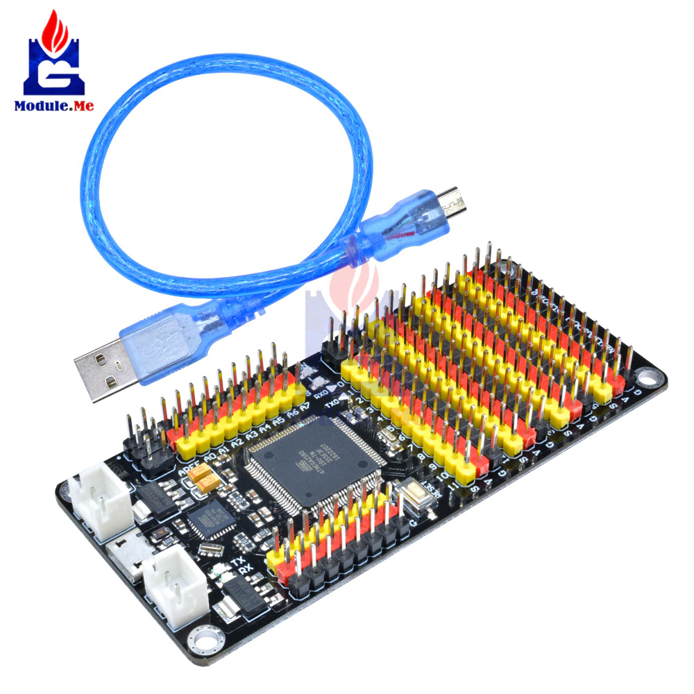

## Voltage Level & Current Differences
The issue of voltage level difference must be addressed because the microcontroller requires 5v to operate and have to control devices with different voltage levels like the motor speed controller and the lights since we are going to use the RGB led strips as lights at the same time as signals. Therefore, we have two different voltage level translators
1.	[Proximity switch](https://www.aliexpress.com/item/32859197984.html?spm=a2g0o.productlist.0.0.15525a32map41U&algo_pvid=b6990937-f5d0-4817-8046-c2e712d89861&algo_expid=b6990937-f5d0-4817-8046-c2e712d89861-11&btsid=0bb0622c16075883405732184e0740&ws_ab_test=searchweb0_0,searchweb201602_,searchweb201603_) voltage level converter
2.	[Relay Board](https://www.aliexpress.com/item/32668242465.html?spm=a2g0s.8937460.0.0.4b622e0eeHvaEL) that controls the lighting and switching the speed controller terminals, ***one of the Relays is used to latches power*** “We implemented but reverted back to manual due to time constrains”
3. [Buck Converter](https://www.aliexpress.com/item/4000064597454.html?spm=a2g0o.productlist.0.0.5c657b1eVM7Ney&algo_pvid=ecee5444-53be-4c3c-a2a5-d37ec487a197&algo_expid=ecee5444-53be-4c3c-a2a5-d37ec487a197-0&btsid=0b0a555a16075900751332448e2ef4&ws_ab_test=searchweb0_0,searchweb201602_,searchweb201603_) To step down the voltage to 5 volts with high current in order to provide the relay board and the Arduino board with required current to operate.

### Proximity switch
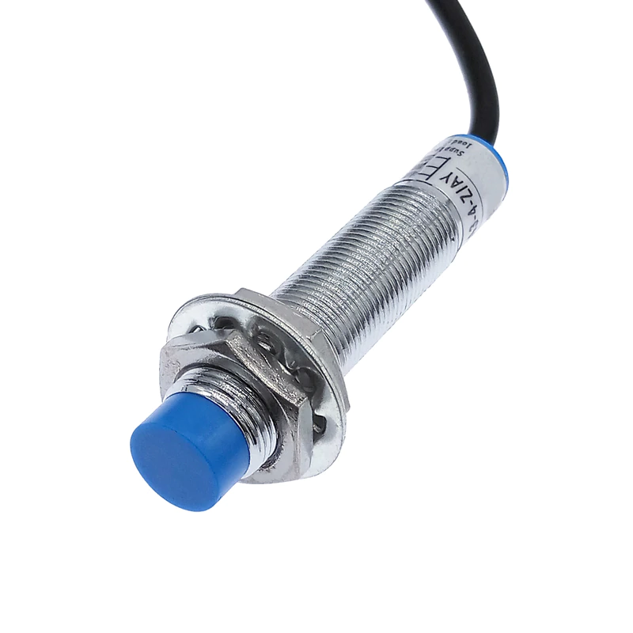

### Relay Board
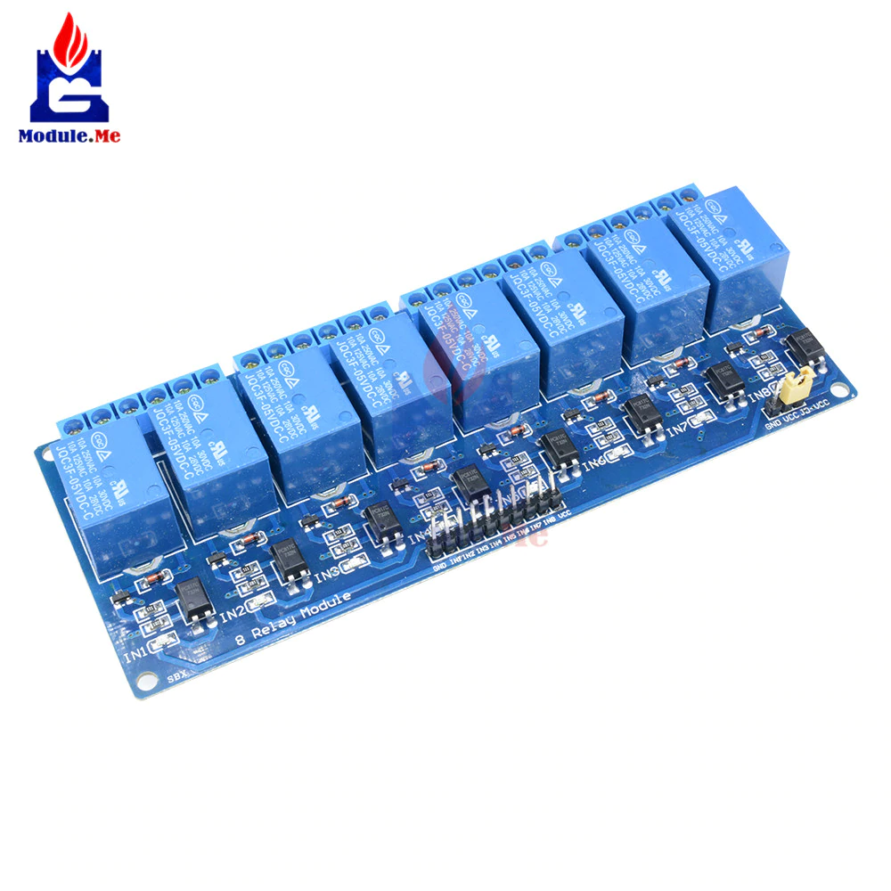

### Buck Converter
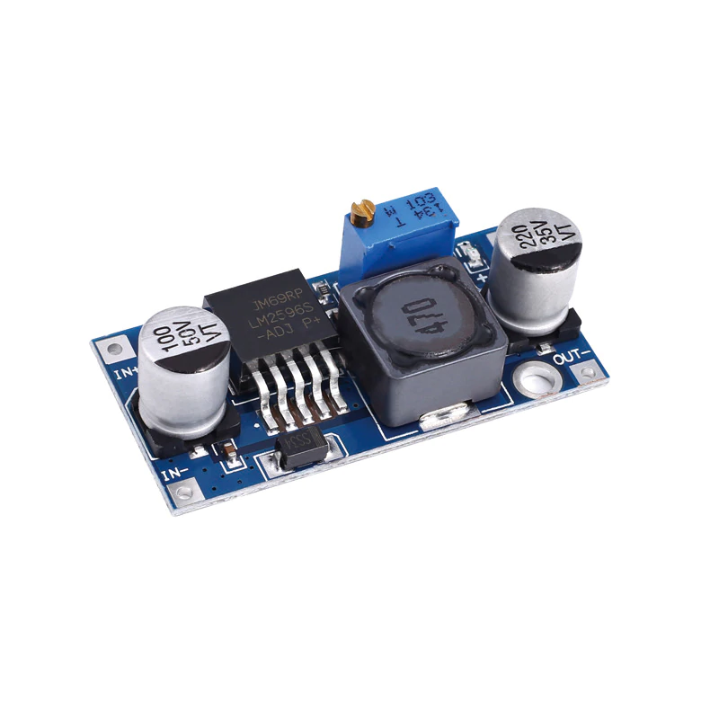

## Implementation
Doing this we need to achieve a neat and tidy design for easy understanding and for future maintenance, feature additions and changes. it can be considered industrial design level based on my industrial experience in Bahrain Flour Mills.
So I planned the thing to be a board control unit with [latching connectors](https://www.aliexpress.com/item/1005001670938151.html?spm=a2g0o.detail.1000013.5.20876d315Q7mTt&gps-id=pcDetailBottomMoreThisSeller&scm=1007.13339.169870.0&scm_id=1007.13339.169870.0&scm-url=1007.13339.169870.0&pvid=cab9caac-b193-4e14-b52a-ee04c93bd0f2&_t=gps-id:pcDetailBottomMoreThisSeller,scm-url:1007.13339.169870.0,pvid:cab9caac-b193-4e14-b52a-ee04c93bd0f2,tpp_buckets:668%230%23131923%2380_668%23808%234094%23274_668%23888%233325%2316_668%232846%238114%23747_668%232717%237563%23541_668%231000022185%231000066059%230_668%233468%2315615%23661) on both sides Inputs and outputs. And one main power [connector 3 to 9 terminals](https://www.aliexpress.com/item/4001236902340.html?spm=a2g0s.8937460.0.0.6d0d2e0ex0mBDq), the relay board and finally the buck converter to step down and regulate the power to the microcontroller.

### Steering Wheel Button Layout
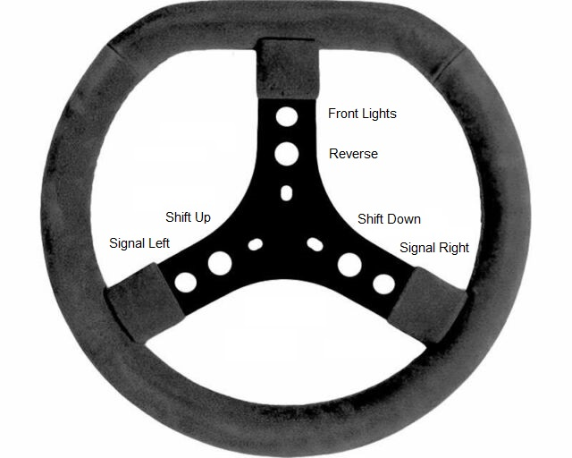

### Electronic Board Layout
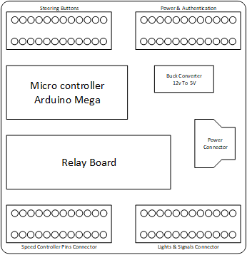

### Connectors 3 to 9 (NC-933)
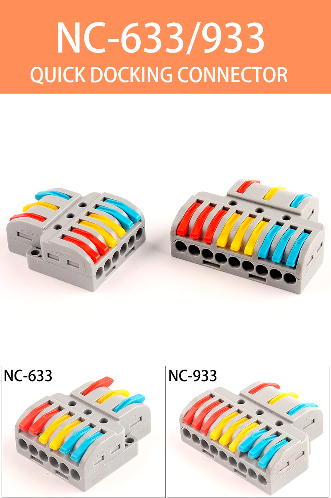

### Latching Connectors (PCT-22-12)
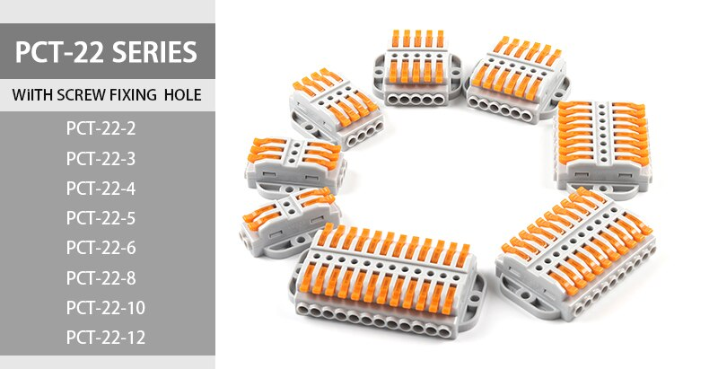

### Picture after implementation
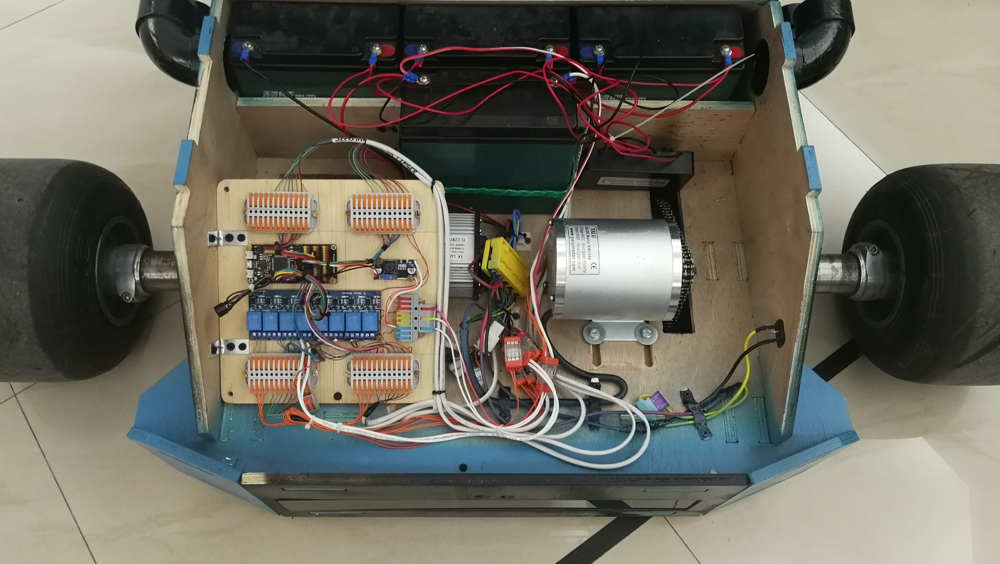

# Electronic Design
Errors discovered after implementation
Everything worked fine when the car was on top of the stand and testing the inputs and outputs, once we put the car on the ground for riding the following issues came up
1.	Suddenly car is triggered for reverse drive while it was supposed to move forward
2.	Signal Lights & Lights gets trigger by them self some times
After investigation based on my experience and examples I went through when dealing with end stops of 3d printers that didn’t have filtering capacitors they tend to pick up motor signal noise as a logic input (electromagnetic wave have an effect wirelessly on neighboring wires causes this). The source of the mull function is the motor, the wires passes close to the motor and yet there is no shielding over them which makes it easy for electromagnetic waves to penetrate the plastic and have an effect on the wires.
Solution
1.	Shield the wires with aluminum foil tape to act as a shield against electromagnetic waves coming from the motor.
2.	Added capacitors 100nF on each input line to ground so that any high frequency noise from the motor will be filtered out and tunneled to the ground.

# The Arduino Code
The Arduino Code consist of three files I usually writ them in chunks to better understand the code and keep related codes in same places.

* ***header.h*** - the Header contains the pin definitions the variables and the libraries required for the code to run.
* ***gocart.ino*** - is the main program file void loop and void setup.
* ***functions.ino*** - is the section where I create function to run to shorten the code and keep it easy to debug.

## Code Display
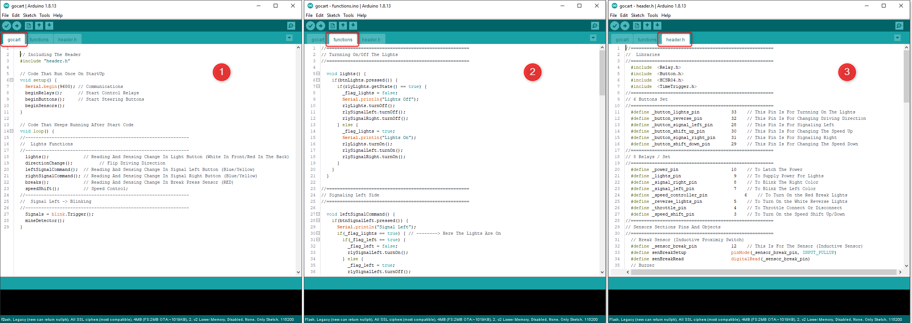

### Download Code
[Right Click Here - Save Link As](./attachments/gocart.zip)

## Flow Chart
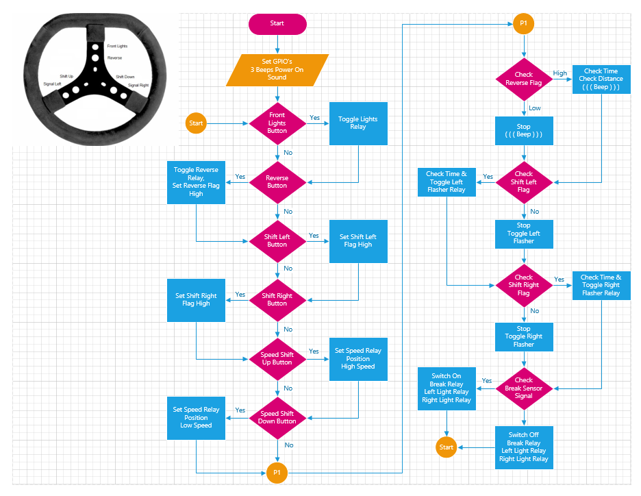

### Download Flow Chart
To download the flowchart in PDF format [Click Here](./attachments/gocartflowchart.pdf), to download the original flowchart diagram in Visio format [Click Here](./attachments/gocartflowchart.vsdx)
